# 教室で使えるかもしれないもの作り #◯ 「1人1台」の教室で、あえて1台を2人で。盤面の大きさを変えられる対戦アプリ「リバーシ」

## 🏫 はじめに

休み時間の教室を見わたすと、子どもたちがそれぞれの端末に向かって、ばらばらに画面をのぞきこんでいる。そんな時間が増えていませんか。

一人一台になって、できることはたしかに増えました。そのいっぽうで、机をくっつけて向かい合う遊びが、教室から少しずつ減っているようにも感じます。かといって、対戦できるものを入れようとすると、アカウントを作る話になったり、通信の許可を取る話になったり、勝ち負けの記録が残る話になったりして、いつのまにか大ごとになってしまいます。

今回作ったのは、その手前で止まっているアプリです。リンクをひらくと、すぐに盤面が出ます。登録もインストールも要りません。1台の端末を2人で囲んで、黒と白を交代で置いていく、ただそれだけのリバーシです。

https://gigayama.github.io/Reversi/

コンピュータとの対戦は入れていません。離れた端末どうしの通信対戦も入れていません。相手が目の前にいないと遊べない作りに、あえてしてあります。1人1台の端末で1人ずつ遊ぶものなら、すでにたくさんあります。この連載で私が作りたかったのは、端末を1台に減らして、子どもたちが顔を上げるきっかけのほうでした。

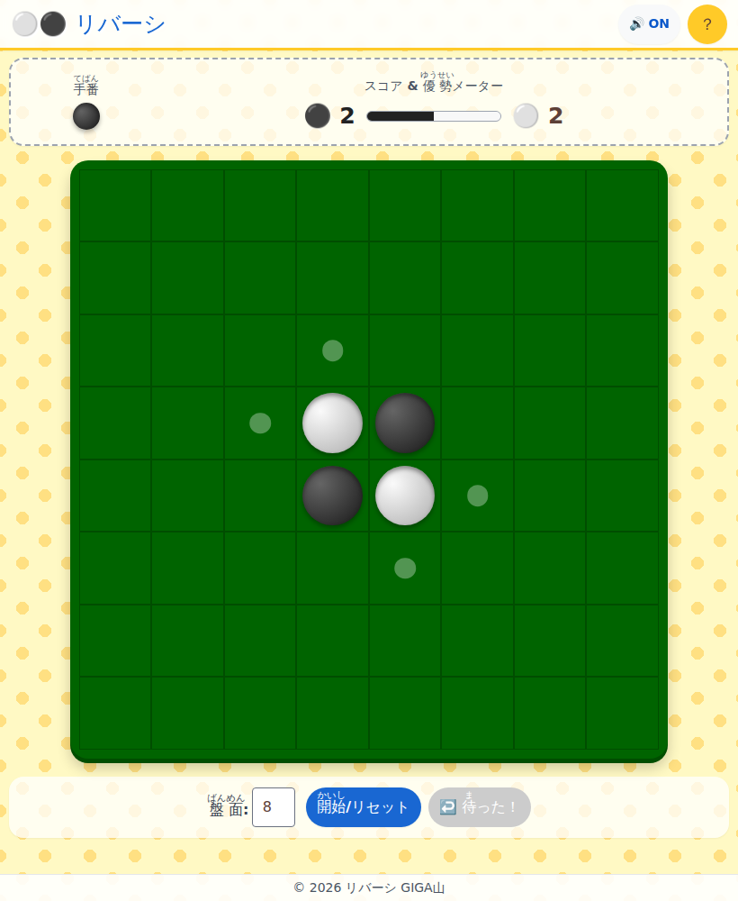

ひらいた直後の画面です。8かける8の盤面と、黒から始まることが、説明なしで分かるようにしています。

## 📱 このアプリでできること

ひらくと、まん中に4つの石が置かれた盤面が出ます。手番は黒からです。

盤面のところどころに、白くうすい丸が光っています。これが「いま石を置ける場所」です。リバーシを知らない子どもでも、光っているところを押していけば、とりあえずゲームは進みます。ルールを覚えてから遊ぶのではなく、遊びながら覚えられるようにしたかったところです。

石を置いた瞬間です。はさんだ石が、置いた場所から近い順に0.1秒ずつずれてめくれていきます。

一度にパッと色が変わるのではなく、置いた石から外側へ順にめくれていくようにしました。どこまではさめたのかが目で追えるようにするためです。とくにはじめのうちは、「なぜこの石が変わったのか」が分からないまま進んでしまいがちなので、そこをゆっくり見せています。

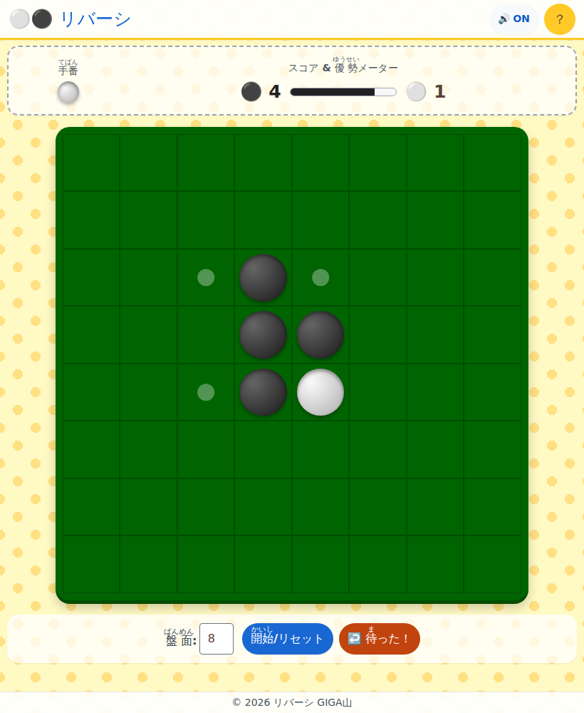

めくれ終わったところです。画面の上に、いまどちらの番か、黒と白それぞれの石が何個か、どちらが優勢かが出ています。

上の帯には、手番の色と、石の数と、優勢をあらわすメーターが並んでいます。手番は色のついた丸で示していますが、色だけでは伝わらない子どももいるので、読み上げのための文字も添えてあります。石の数は、置くたびに変わります。この数字を見ながら「いま勝ってる」「さっき逆転された」と言い合えるところまでが、リバーシの楽しさだと思っています。

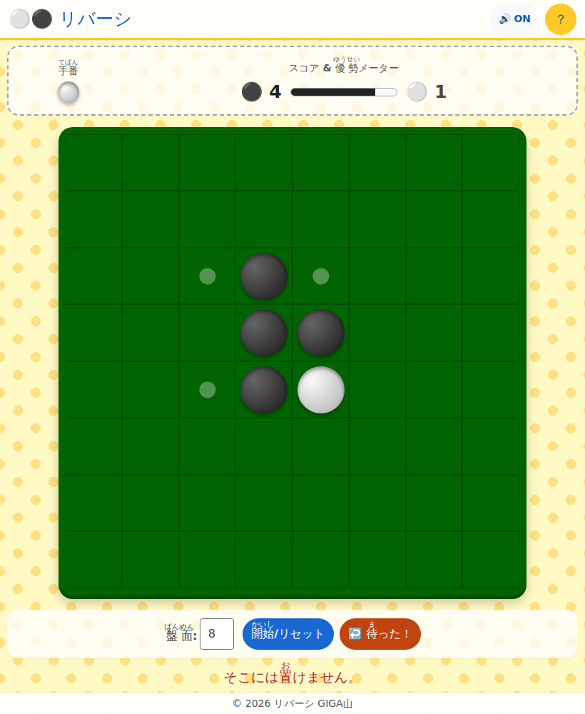

置けないところを押すと、赤い字で知らせます。故障ではありません。

はじめて遊ぶ子どもは、まず置けないところを押します。そのときに何も起きないと「こわれた」と言いに来ます。だから、押したことは受け取ったうえで、置けない理由を短く返すようにしました。音も、置いたときとは違う低い音が鳴ります。

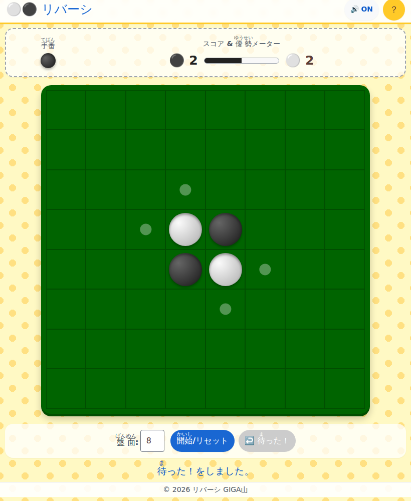

「待った！」を押すと1手ぶん戻ります。回数の制限はありません。

指がすべって置いてしまった、という場面がどうしても出ます。そこで泣いてしまうと、休み時間が終わってしまいます。「待った！」は回数を数えていません。何回でも戻せます。パスも1手として戻せます。何手でも戻れるので、はじめのほうまでさかのぼって「あそこでこうしていたら」と並べ直すこともできます。

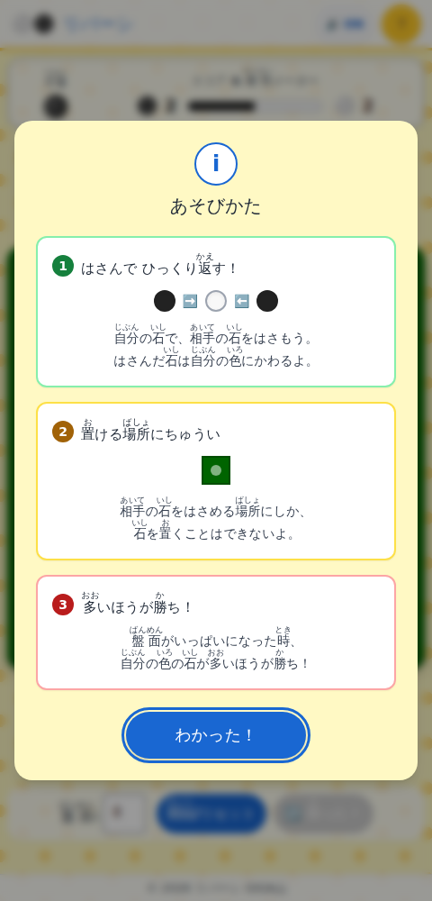

右上の「？」を押すと出てくる説明です。3つだけにしぼってあります。

ルールの説明は、子どもが自分で読めるように書きました。全部にふりがなを振って、3ステップだけにしています。はさむこと、置ける場所が決まっていること、多いほうが勝ちであること。この3つが分かれば始められます。先生がルールを説明して回らなくてよくなればと思っています。

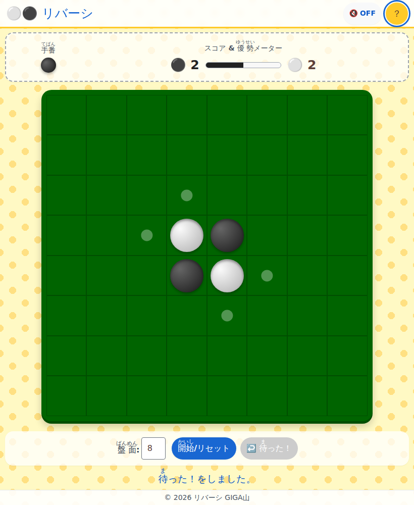

右上のボタンで音を消せます。消すと表示が変わるので、いまどちらなのかがひと目で分かります。

音は、石を置いたとき、石がめくれるとき、パスのとき、「待った！」のとき、勝ったときに鳴ります。教室全体で使うときや、音に敏感な子どもがいるときのために、画面から消せるようにしました。音声のファイルは1つも持っていません。その場で音を作って鳴らしているので、読み込みで待たされることもありません。

## 🔢 盤面の大きさを、4から12まで変えられます

このアプリでいちばん時間をかけたのは、盤面の大きさを変えられるようにしたところです。

ふつうのリバーシは8かける8です。ですが低学年の子どもにとって、8かける8は長すぎます。休み時間の残りが10分を切っているときも、始めたら終わりません。途中でチャイムが鳴って、そのまま放り出されてしまいます。

そこで、画面の下にある「盤面」の欄の数字を変えて「開始/リセット」を押すと、盤面の大きさが変わるようにしました。使えるのは4、6、8、10、12の5とおりです。

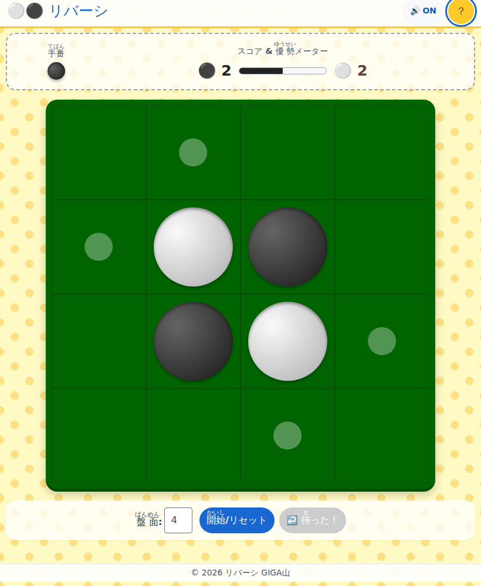

4かける4にしたところです。数分で終わります。

4かける4は、置ける場所がすぐ埋まるので、あっという間に終わります。1年生や、休み時間の残りが少ないときに向いています。6かける6が低学年向け、8かける8がふつうのリバーシ、10かける10と12かける12は高学年やじっくり遊びたいときです。

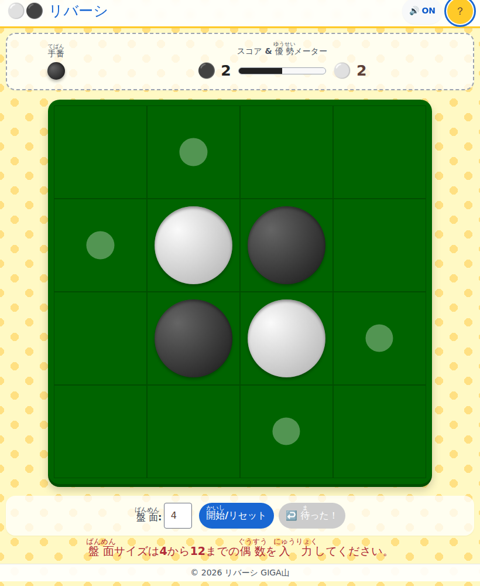

奇数や範囲の外の数字を入れると、赤い字で知らせます。このとき盤面は変わりません。

数字の欄は、子どもが自由にさわれます。だから5や7や100を入れる子が必ず出ます。そこで、使えない数字だったときは、その理由を出したうえで、いま遊んでいる盤面はそのままにしています。遊んでいる途中に別の子が数字をいじっても、対戦が消えないようにするためです。欄の数字のほうは、いま使っているサイズに戻ります。

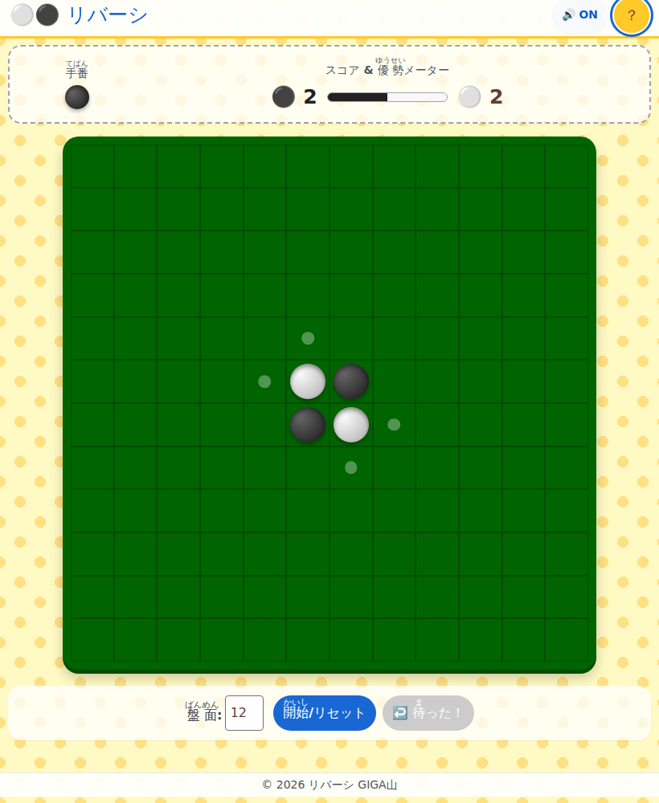

12かける12にしたところです。盤面は画面のあいているところいっぱいまで自動で広がります。

盤面の大きさが変わっても、マスは正方形のままです。画面の空いている領域をぜんぶ使って、そこに正方形が収まるように毎回計算しています。電子黒板に映しても、手元の端末で見ても、同じ形で見えます。

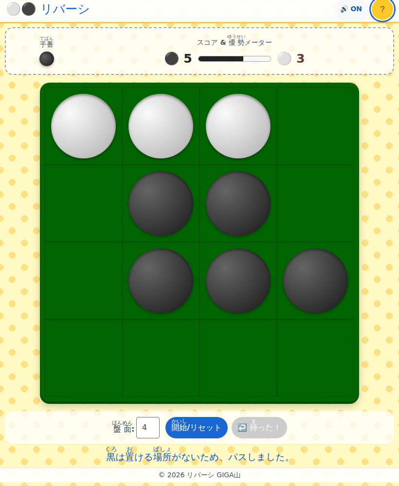

置ける場所が無いときは、自動でパスします。1秒半ほど案内を出してから相手の番になります。

盤面を小さくすると、置ける場所が無くなる場面が増えます。ここで黙って手番が移ると、子どもたちは「なんで自分の番なの」と混乱します。だから、どちらがパスしたのかを文字で出し、少し待ってから手番を移すようにしました。すぐに切りかえないのは、読む時間を作るためです。

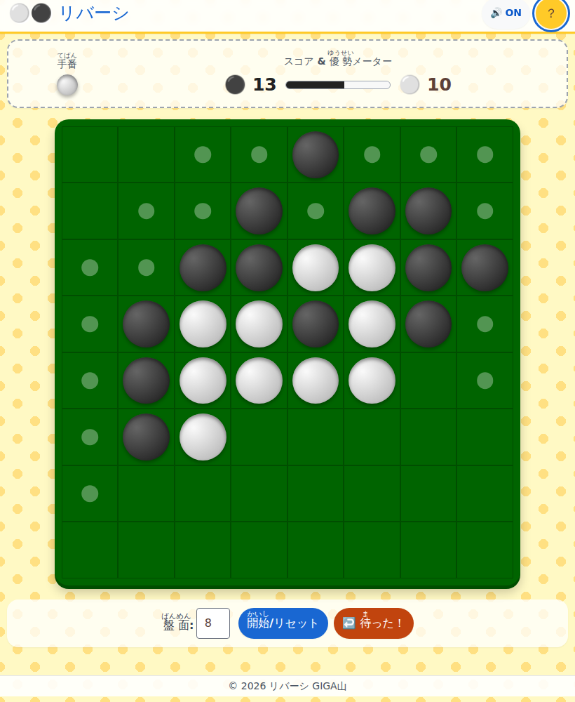

打ち進めたところです。石の数とメーターが動くので、どちらが優勢かが分かります。

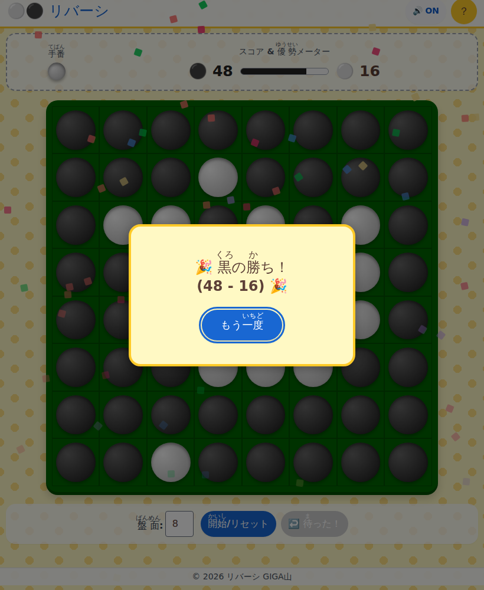

盤面が埋まると紙吹雪が出て、石の数つきで勝敗が出ます。

終わり方は2つあります。盤面が全部うまるか、黒と白の両方が続けて置けなくなるかです。どちらの場合も紙吹雪が出て、どちらが何個で勝ったのかを出します。数字を添えているのは、「28対36で負けた」と言えたほうが、次にどうするかの話になりやすいと思ったからです。

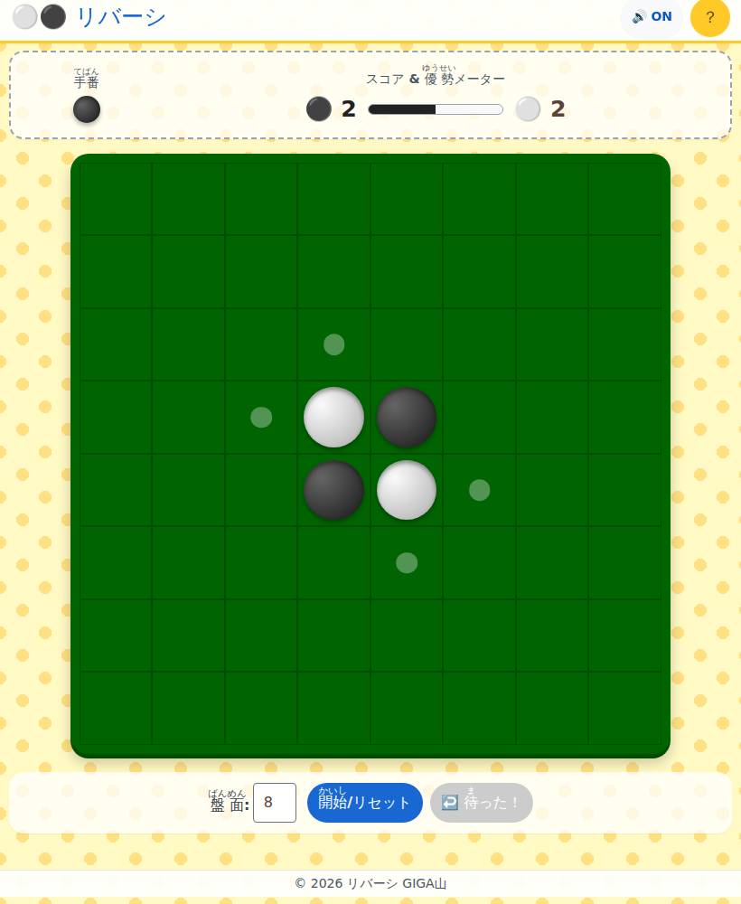

「もう一度」を押すと、そのときの盤面の大きさのまま、すぐ次の対戦が始まります。

終わったあとに毎回サイズを入れ直すのは面倒なので、「もう一度」は同じ大きさのまま始まるようにしました。4かける4で遊んでいたら4かける4のまま、次が始まります。

## 🙌 だれも置いていかれないようにしたところ

盤面の大きさの次に時間をかけたのが、ここです。

まず、画面じゅうの漢字にふりがなを振ってあります。ふりがなが要るのは低学年の子どもですから、そこが読めないと、そもそもこのアプリを使えません。色のついたボタンの上にふりがなを置くと読めなくなることがあるので、ボタンの色に合わせてふりがなの色も変わるようにしてあります。

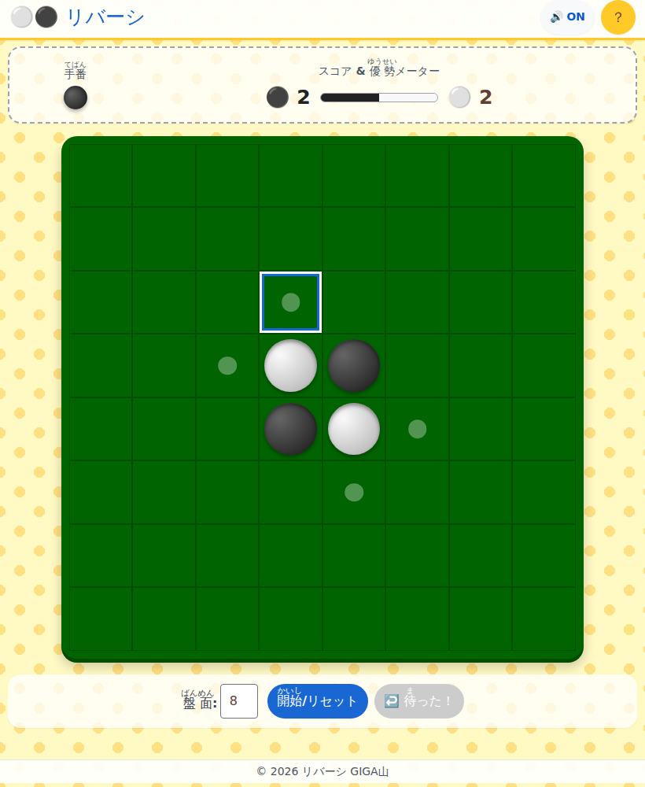

タブキーを押すと、石を置ける場所だけを順に移動します。いま選んでいるマスは白い枠で囲まれます。

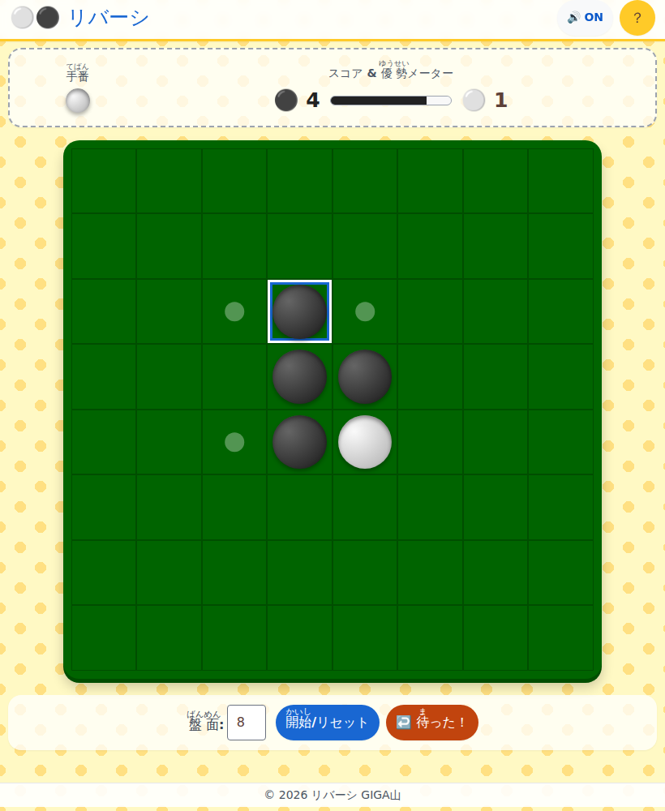

エンターキーかスペースキーで石を置けます。

マウスやタッチが使いにくい子どものために、キーボードだけでも遊べるようにしました。ここで一度作り直しています。はじめは全部のマスをタブキーで回れるようにしていたのですが、8かける8だと64回押さないと反対側にたどりつけません。それでは使えないので、「石を置ける場所」だけを回るようにしました。置ける場所は多くても十数か所なので、数回押せば目当てのマスに届きます。

音を消せることも、ここに入ります。感覚が過敏な子どもにとって、急に鳴る音はそれだけで教室にいられない理由になります。先生に言いに行かなくても、自分でボタンを押せば消せる、というところまで用意したかったところです。

画面の大きさについても、下のほうまで確かめてあります。

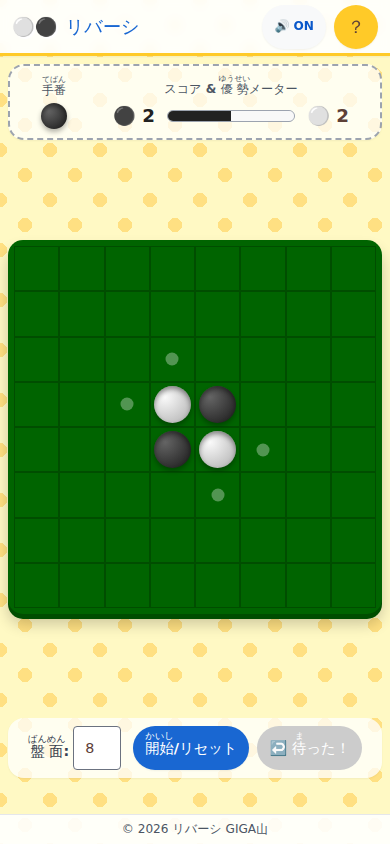

スマートフォンの幅で開いたところです。

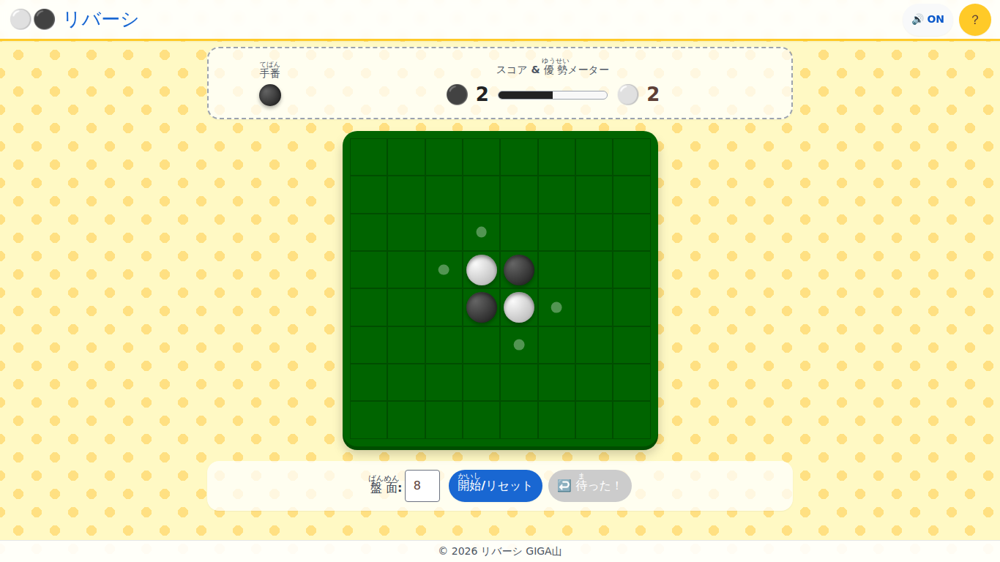

Chromebookの幅で開いたところです。盤面が画面の高さいっぱいまで広がります。

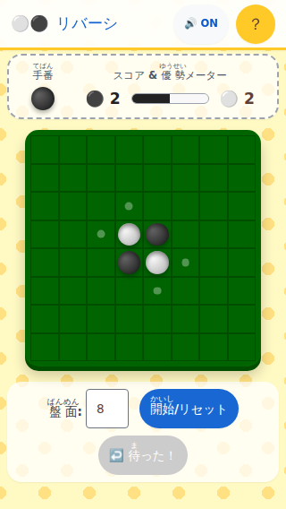

横320ピクセルという、いちばん狭い条件で開いたところです。横スクロールは出ません。

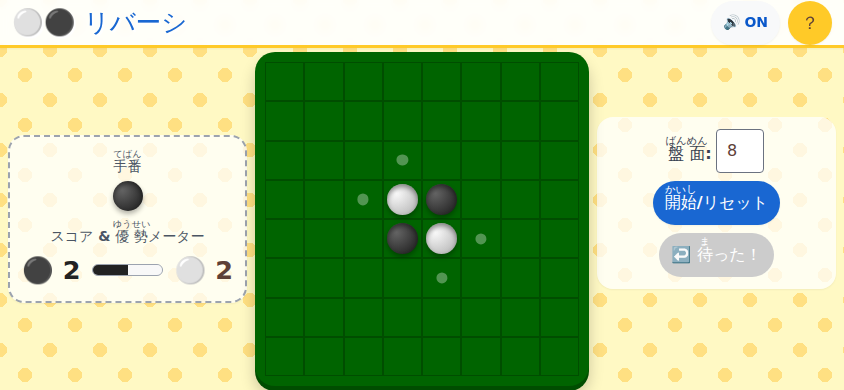

横向きにすると、スコアと盤面と操作パネルが横に並び替わります。盤面の大きさを保つためです。

拡大も禁止していません。字が小さいと感じたら、ブラウザの拡大がそのまま使えます。iPadなら2本指を広げる操作です。読みにくい人が自分で大きくできる余地を、アプリの都合で塞がないようにしています。

## ✨ 導入のメリット

三つのいいことが期待できます。

一つ目は、準備がいらないことです。リンクを配るだけで始められます。アカウントを作る必要も、名簿を登録する必要もありません。子どもの名前も出席番号も、このアプリはそもそも受け取る場所を持っていません。入力する欄が無いのは、盤面の大きさの数字を入れるところだけです。だから保護者の同意を取る話にもなりませんし、情報担当の先生に相談することも少なくて済みます。

二つ目は、先生が見ていなくていいことです。このアプリは対戦の記録を残しません。端末の外へ送らないだけでなく、端末の中にも保存していません。再読み込みすれば、いつでも8かける8の最初の盤面に戻ります。誰が何回勝ったかが積み上がらないので、順位表もできませんし、休み時間のたびに勝ち数の話でもめることもないはずです。記録が残らないことを不便だと感じる方もいると思いますが、休み時間の遊びについては、残らないほうがいいと考えて、そう作りました。

三つ目は、電波が弱くても止まらないことです。一度ひらいた端末なら、そのあとはインターネットにつながっていなくても遊べます。校舎のはしのほうや体育館わきの教室など、電波が弱い場所は学校のなかに必ずあります。そこで「読み込み中」のまま休み時間が終わってしまうのは、いちばんもったいない終わり方です。ホーム画面に置いておけば、アイコンから開けて、圏外でも起動します。

## 🛠️ 【管理者向け】導入手順

情報担当の先生に確認されそうなことを、先にまとめておきます。

配信しているアドレスはこちらです。

https://gigayama.github.io/Reversi/

校内のフィルタリングで許可が必要になるのは gigayama.github.io です。このほかに fonts.googleapis.com と fonts.gstatic.com へ出ていきますが、これは文字の見た目のためだけのものです。この2つが塞がれている状態でも、すべての機能が動くことを確かめてあります。塞がれている場合は、端末に入っている日本語の書体で表示されるだけです。

個人情報については、あつかっていません。名前や出席番号を入れる欄がなく、対戦の記録も端末の外へ送りません。端末の中にも保存していないので、共用の端末で使っても、次に使う子どもに前の子どもの記録が残ることはありません。

共用端末での注意は1つだけです。再読み込みすると対戦が最初からになります。途中経過を保存していないためです。対戦の途中でタブを閉じないよう、子どもたちに伝えておいてください。

ホーム画面に置いておくと、アイコンから開けるようになり、圏外でも起動します。手順は端末ごとに違います。

ChromebookとWindowsのChromeやEdgeの場合は、次のとおりです。

1. アプリをひらく
2. 画面の右上に「アプリにする」というボタンが出たら、それを押す
3. 出ていない場合は、アドレスバーの右端にあるインストールのアイコンから追加する

iPadとiPhoneのSafariの場合は、次のとおりです。

1. 画面の下、iPadでは上にある共有ボタンを押す
2. メニューを下にスクロールして「ホーム画面に追加」を押す
3. 右上の「追加」を押す

Safariには「アプリにする」ボタンが出ません。これはSafariの側の仕様なので、上の手順で追加してください。

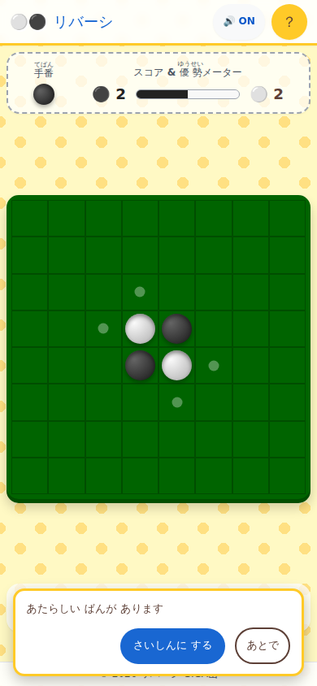

新しい版を用意すると、画面の下に知らせが出ます。押すまで切りかわりません。

アプリを新しくしたときは、子どもたちの画面の下に「あたらしい ばんが あります」という帯が出ます。ここを押すまで切りかわらないようにしてあります。対戦の最中に勝手に入れ替わると、並べたばかりの盤面が消えてしまうからです。すぐでなくてよければ「あとで」を押せば消えます。

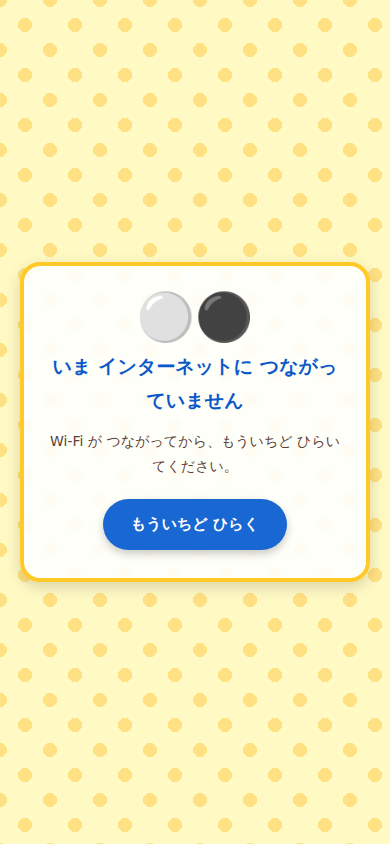

一度もひらいたことがない端末で、電波が無いときだけ出る画面です。

この画面が出るのは、その端末でこのアプリを一度もひらいたことがなく、しかも電波が無いときだけです。一度でもひらいたことがあれば、圏外でも盤面が出ます。子どもから「開かない」と言われたときは、まずこの画面が出ていないかを見てください。出ていれば、電波の問題です。

## 📖 【利用者向け】使い方のガイド

子どもたちに配るときの手順です。

1. リンクをひらく。8かける8の盤面が出て、黒の番から始まります
2. 1台の端末を2人で囲む。黒の子と白の子を決めます
3. 光っている丸を押す。そこが石を置ける場所です
4. はさんだ相手の石が、自分の色に変わります
5. 交代で置いていきます。置ける場所が無いほうは自動でパスになります
6. 盤面がうまるか、両方とも置けなくなったら終わりです。石が多いほうの勝ちです
7. 「もう一度」を押すと、同じ大きさのまますぐ次が始まります

盤面の大きさを変えるときは、次のとおりです。

1. 画面の下にある「盤面」の欄の数字を変える
2. 「開始/リセット」を押す
3. 使えるのは4、6、8、10、12です。それ以外を入れると赤い字で知らせが出ます

そのほかの操作です。

1. 置いた場所をまちがえたら「待った！」を押す。何回でも戻せます
2. 音を消したいときは、右上の音のボタンを押す
3. あそびかたを読みたいときは、右上の「？」を押す。エスケープキーか「わかった！」で閉じます
4. マウスやタッチが使いにくいときは、タブキーで置ける場所を選んで、エンターキーかスペースキーで置く

うまくいかないときは、いちど再読み込みしてください。Chromebookならコントロールとシフトとアールの3つを同時に押します。ただし再読み込みすると対戦は最初からになりますので、対戦中は避けてください。

## 📝 まとめ

このアプリには、経験値もコインも連続記録もありません。順位表もありません。作れなかったのではなく、入れませんでした。

休み時間に子どもたちが端末を持っているとき、その画面の向こうにあるのが、ためこんだ数字ではなく、目の前にいる友だちであってほしいと思ったからです。石の数を数えて笑ったり、「あーっ」と声を上げたり、「もう一度」を押しながら次はどう置くか話したり。そういう時間が少しでも増えるといいなと思って作りました。

ICTを使うと、たしかにいろいろなことが速くなります。ただ、速くすること自体が目的ではないはずです。速くなったぶんで空いた時間に、子どもたちと向かい合えるかどうかが、いちばん大事なところだと思っています。このアプリでいえば、ルールを説明して回る時間や、記録を管理する時間を減らして、そのぶん子どもたちのやりとりを横で見ていられる時間になれば、と考えています。

リンクをひらくだけです。うまくいかなければ、タブを閉じれば終わりです。試すのにかかるものが何もないというのは、それだけで一歩を踏み出しやすい条件だと思います。

一歩踏み出そうとする先生を、私はいつでも全力で応援しています。
